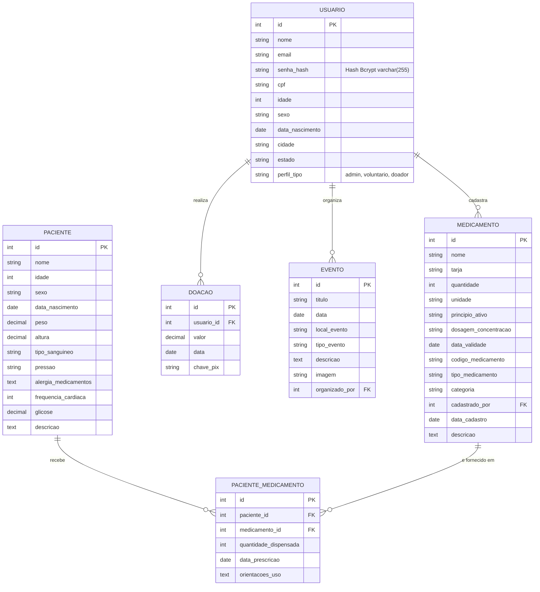

# Diagrama de Entidades/Relacionamentos (DER)

---

# Arquitetura do Banco de Dados

## Visão Geral do Banco de Dados

O ecossistema de dados da plataforma **Saúde Conectada** adota o sistema gerenciador de banco de dados relacional **PostgreSQL** (hospedado via **Supabase**). O modelo foi desenvolvido com foco na integridade referencial, conformidade com a LGPD e rastreabilidade das operações de estoque e atendimento em campo.

A persistência é gerenciada na camada Back-end pelo **Sequelize ORM**, garantindo sanitização automática de consultas SQL para prevenção de ataques como *SQL Injection*.

## Estrutura do Diagrama Entidade-Relacionamento (DER)

O modelo relacional é composto por 6 entidades principais, estruturadas para suportar a gestão de voluntários, controle farmacêutico, registros clínicos e doações:

### Entidades e Responsabilidades

- **`USUARIO`****:** Centraliza o controle de acesso e autenticação dos atores do sistema (*Administradores*, *Voluntários* e *Doadores*). A coluna `senha_hash` armazena exclusivamente o resultado da criptografia unidirecional via **Bcrypt**, impedindo o armazenamento de senhas em texto puro.
- **`PACIENTE`****:** Mantém os dados cadastrais, históricos de saúde e medições vitais (glicose, pressão, frequência cardíaca) dos assistidos pelas ações sociais da ONG.
- **`MEDICAMENTO`****:** Gerencia o inventário farmacêutico e de insumos, contendo dados críticos para controle de validade e lote. Possui chave estrangeira (`cadastrado_por`) vinculada a `USUARIO` para auditoria das entradas.
- **`PACIENTE_MEDICAMENTO`** **(Tabela Associativa):** Resolve a relação N\:N entre pacientes e medicamentos. Registra o histórico de saídas de estoque e prescrições médicas, indicando a quantidade dispensada, data e orientações de uso.
- **`DOACAO`****:** Registra a entrada de recursos financeiros destinados à ONG, vinculando cada transação ao seu doador via `usuario_id`.
- **`EVENTO`****:** Mapeia ações de saúde, feiras e mutirões organizados em campo. A chave estrangeira `organizado_por` vincula o evento ao coordenador/administrador responsável.