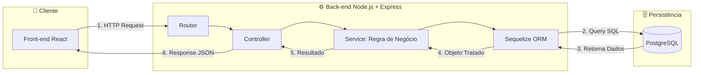

# Documentação do Back-end - Sistema ONG

## 1. Diagrama de Fluxo Interno

```mermaid
flowchart LR
    subgraph Client["📱 Cliente"]
        A[Front-end React]
    end

    subgraph Server["⚙️ Back-end Node.js + Express"]
        B[Router] --> C[Controller]
        C --> D[Service: Regra de Negócio]
        D --> E[Sequelize ORM]
    end

    subgraph Database["🗄️ Persistência"]
        F[(PostgreSQL)]
    end

    A -->|1. HTTP Request| B
    E -->|2. Query SQL| F
    F -->|3. Retorna Dados| E
    E -->|4. Objeto Tratado| D
    D -->|5. Resultado| C
    C -->|6. Response JSON| A

```
---
