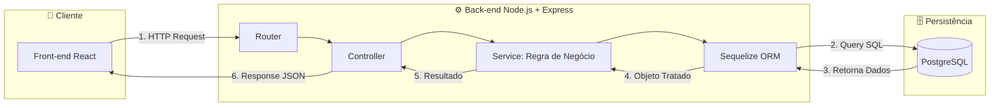

# Diagrama de Fluxo Interno

---
## Fluxo Interno de Processamento de Dados

O processamento de requisições na arquitetura do Back-end segue o padrão arquitetural em camadas (**MVC / Service-Repository**), garantindo o desacoplamento de responsabilidades e facilitando a manutenção e os testes da aplicação.

## Detalhamento das Etapas do Fluxo

- **1. Envio da Requisição HTTP (Front-end $\rightarrow$ Router):** A aplicação cliente (React) dispara uma requisição HTTP/HTTPS (como `GET`, `POST`, `PUT` ou `DELETE`) transportando dados no formato JSON e tokens de autenticação via *Header Authorization*.
- **2. Roteamento e Interceptação (Router $\rightarrow$ Controller):** O arquivo de rotas (`Router`) do Express recebe a requisição, identifica o *endpoint* solicitado e direciona o fluxo para o *Controller* correspondente. Se a rota for protegida, os *middlewares* de autenticação (JWT) e validação de dados atuam nesta etapa antes de liberar a execução.
- **3. Controle de Entrada e Saída (Controller $\rightarrow$ Service):** O *Controller* é responsável por extrair os dados da requisição (`req.params`, `req.query` ou `req.body`) e repassá-los para a camada de serviços. Ele não executa regras de negócio diretas nem consultas ao banco de dados.
- **4. Execução da Regra de Negócio (Service $\rightarrow$ Sequelize ORM):** A camada de *Service* aplica as validações de domínio (como verificar permissões de usuário, calcular estoque ou validar requisitos de negócio) e aciona as funções do **Sequelize ORM** para interação com o banco.
- **5. Consulta e Persistência (Sequelize ORM $\leftrightarrow$ PostgreSQL):** O Sequelize traduz os métodos Javascript em instruções SQL tratadas e parametrizadas, enviando as *queries* com segurança para o banco de dados **PostgreSQL** para escrita ou leitura.
- **6. Tratamento e Resposta (PostgreSQL $\rightarrow$ Front-end):** Os dados retornados pelo PostgreSQL são convertidos pelo ORM em objetos Javascript nativos, devolvidos à camada de *Service* para formatação final e repassados ao *Controller*, que finaliza a transação enviando uma resposta padronizada em JSON com o código HTTP adequado (`200 OK`, `201 Created`, `401 Unauthorized`, etc.).