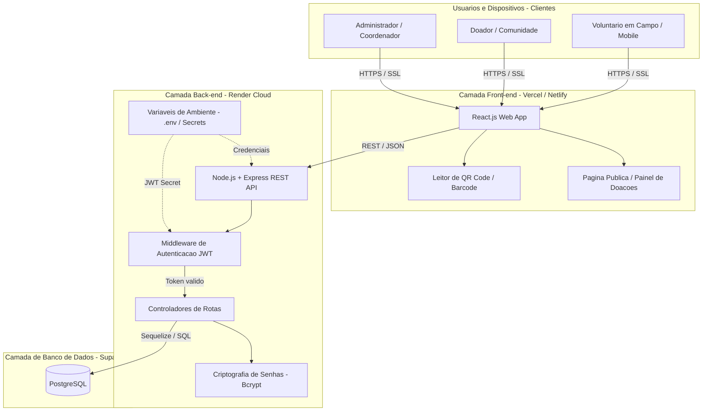

 # ARQUITETURA DA SOLUÇÃO E INFRAESTRUTURA EM NUVEM

**Projeto:** Saúde Conectada
**Equipe:** Nextgen_devs
**Responsável:** Apolo (DevOps)

---

## 1. Diagrama de Arquitetura do Sistema 

---

# Mapeamento da Arquitetura em Nuvem e Fluxo de Dados

## Descrição do Fluxo da Arquitetura

O sistema adota uma arquitetura em camadas totalmente desacoplada, utilizando o modelo **PaaS (Platform as a Service)** para hospedagem em nuvem, garantindo escalabilidade, segurança e baixo custo operacional.

* **Camada de Clientes (Usuários e Dispositivos):** Os acessos são realizados por voluntários em campo, doadores da comunidade e administradores do projeto social. Todas as interações ocorrem via navegação web/mobile protegida por criptografia **HTTPS/SSL**.

* **Camada Front-end (Vercel / Netlify):** Aplicação Single Page Application (SPA) desenvolvida em **React.js**. Ela integra o leitor de QR Code/Código de Barras via câmera para movimentação de estoque em campo e disponibiliza as páginas públicas de transparência e doações.

* **Camada Back-end (Render Cloud):** API RESTful construída em **Node.js com Express**.

  * **Middleware JWT:** Intercepta as requisições para verificar a validade do token de autenticação antes de liberar o acesso às rotas protegidas (`/estoque`, `/voluntarios`, `/doacoes`).
  * **Variáveis de Ambiente (`.env`):** Mantêm as chaves de assinatura do JWT (`JWT_SECRET`) e as credenciais de banco isoladas na nuvem.
  * **Bcrypt:** Módulo responsável por gerar o hash e comparar senhas no processo de autenticação.

* **Camada de Banco de Dados (Supabase / PostgreSQL):** Banco de dados relacional gerenciado na nuvem. O acesso é feito de forma segura e exclusiva a partir da camada Back-end via ORM (Sequelize), garantindo a integridade e persistência de todas as entidades do sistema.
