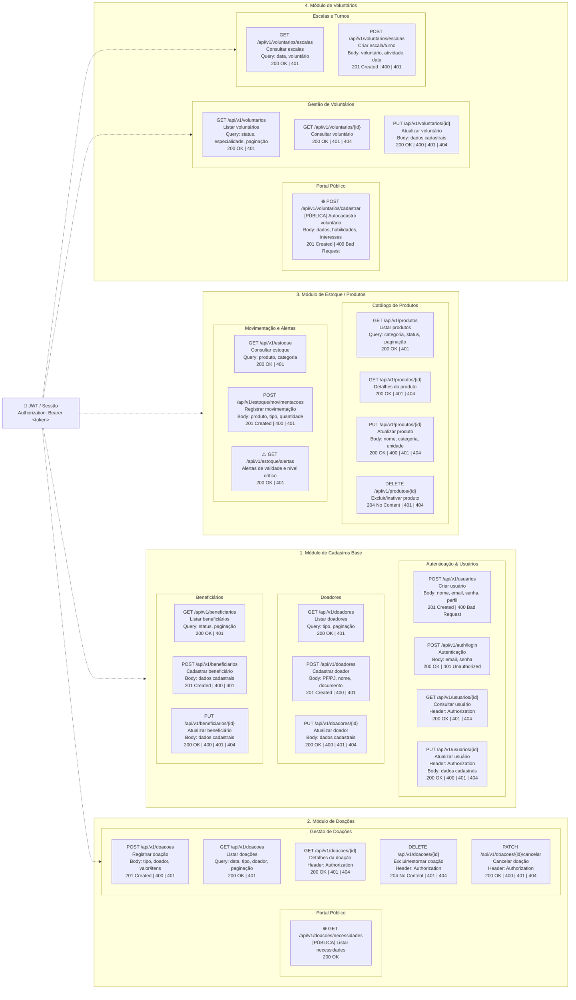

# Mapeamento e Documentação das Rotas da API (REST)

#### 1. Módulo de Cadastros Base

* **`POST /api/v1/usuarios`**

  * **Acesso:** Protegido (JWT)
  * **Descrição:** Criação de novos usuários no sistema.
  * **Body:** `{ "nome": "String", "email": "String", "senha": "String", "perfil": "String" }`
  * **Respostas:** `201 Created` | `400 Bad Request` | `401 Unauthorized`

* **`POST /api/v1/auth/login`**

  * **Acesso:** **Público**
  * **Descrição:** Autenticação de usuários (Coordenador/Voluntário) e geração de token JWT.
  * **Body:** `{ "email": "String", "senha": "String" }`
  * **Respostas:** `200 OK` | `401 Unauthorized`

* **`GET /api/v1/usuarios/{id}`**

  * **Acesso:** Protegido (JWT)
  * **Descrição:** Consulta de dados do usuário autenticado.
  * **Header:** `Authorization: Bearer <token>`
  * **Respostas:** `200 OK` | `401 Unauthorized` | `404 Not Found`

* **`PUT /api/v1/usuarios/{id}`**

  * **Acesso:** Protegido (JWT)
  * **Descrição:** Atualização dos dados cadastrais do usuário.
  * **Header:** `Authorization: Bearer <token>`
  * **Body:** `{ "nome": "String", "email": "String" }`
  * **Respostas:** `200 OK` | `400 Bad Request` | `401 Unauthorized` | `404 Not Found`

* **`GET /api/v1/doadores`** | **`POST /api/v1/doadores`** | **`PUT /api/v1/doadores/{id}`**

  * **Acesso:** Protegido (JWT)
  * **Descrição:** Listagem (com paginação/filtros), cadastro (PF/PJ) e atualização de doadores parceiros da ONG.
  * **Respostas:** `200 OK` | `201 Created` | `400 Bad Request` | `401 Unauthorized` | `404 Not Found`

* **`GET /api/v1/beneficiarios`** | **`POST /api/v1/beneficiarios`** | **`PUT /api/v1/beneficiarios/{id}`**

  * **Acesso:** Protegido (JWT)
  * **Descrição:** Gestão e registro de pessoas ou famílias assistidas pelo projeto social.
  * **Respostas:** `200 OK` | `201 Created` | `400 Bad Request` | `401 Unauthorized` | `404 Not Found`

#### 2. Módulo de Doações e Transparência

* **`GET /api/v1/doacoes/necessidades`**

  * **Acesso:** **Público**
  * **Descrição:** Exibe a lista pública de insumos e remédios em falta na ONG para direcionar os doadores no site/portal.
  * **Respostas:** `200 OK`

* **`POST /api/v1/doacoes`**

  * **Acesso:** Protegido (JWT)
  * **Descrição:** Registro de entradas de doações (financeiras ou de insumos).
  * **Body:** `{ "tipo": "MEDICAMENTO/FINANCEIRO", "doador_id": "Integer", "itens": [...] }`
  * **Respostas:** `201 Created` | `400 Bad Request` | `401 Unauthorized`

* **`GET /api/v1/doacoes`** | **`GET /api/v1/doacoes/{id}`**

  * **Acesso:** Protegido (JWT)
  * **Descrição:** Listagem geral com filtros (data, tipo) e consulta detalhada de uma doação.
  * **Respostas:** `200 OK` | `401 Unauthorized` | `404 Not Found`

* **`DELETE /api/v1/doacoes/{id}`** | **`PATCH /api/v1/doacoes/{id}/cancelar`**

  * **Acesso:** Protegido (JWT)
  * **Descrição:** Estorno, exclusão física ou cancelamento lógico de lançamentos de doação.
  * **Respostas:** `200 OK` | `204 No Content` | `401 Unauthorized` | `404 Not Found`

#### 3. Módulo de Estoque e Produtos

* **`GET /api/v1/produtos`** | **`GET /api/v1/produtos/{id}`**

  * **Acesso:** Protegido (JWT)
  * **Descrição:** Consulta ao catálogo de produtos/medicamentos mapeados pela ONG.
  * **Respostas:** `200 OK` | `401 Unauthorized` | `404 Not Found`

* **`PUT /api/v1/produtos/{id}`** | **`DELETE /api/v1/produtos/{id}`**

  * **Acesso:** Protegido (JWT)
  * **Descrição:** Edição de especificações do produto e inativação no catálogo.
  * **Respostas:** `200 OK` | `204 No Content` | `400 Bad Request` | `401 Unauthorized` | `404 Not Found`

* **`GET /api/v1/estoque`**

  * **Acesso:** Protegido (JWT)
  * **Descrição:** Consulta do saldo atualizado de insumos armazenados.
  * **Respostas:** `200 OK` | `401 Unauthorized`

* **`POST /api/v1/estoque/movimentacoes`**

  * **Acesso:** Protegido (JWT)
  * **Descrição:** Registro de baixa (uso em ações de rua) ou entrada de itens via leitura de código de barras ou manual.
  * **Body:** `{ "produto_id": "Integer", "tipo": "ENTRADA/SAIDA", "quantidade": "Integer" }`
  * **Respostas:** `201 Created` | `400 Bad Request` | `401 Unauthorized`

* **`GET /api/v1/estoque/alertas`**

  * **Acesso:** Protegido (JWT)
  * **Descrição:** Retorna dados para o painel de controle contendo itens com validade próxima (< 30 dias) ou com quantidade abaixo do estoque mínimo.
  * **Respostas:** `200 OK` | `401 Unauthorized`

#### 4. Módulo de Voluntários e Escalas

* **`POST /api/v1/voluntarios/cadastrar`**

  * **Acesso:** **Público**
  * **Descrição:** Portal de solicitação/autocadastro para novos voluntários e profissionais de saúde interessados em ajudar.
  * **Body:** `{ "nome": "String", "email": "String", "telefone": "String", "habilidades": "String" }`
  * **Respostas:** `201 Created` | `400 Bad Request`

* **`GET /api/v1/voluntarios`** | **`GET /api/v1/voluntarios/{id}`** | **`PUT /api/v1/voluntarios/{id}`**

  * **Acesso:** Protegido (JWT)
  * **Descrição:** Gestão administrativa de voluntários, aprovações de cadastro e atualização de perfis.
  * **Respostas:** `200 OK` | `400 Bad Request` | `401 Unauthorized` | `404 Not Found`

* **`GET /api/v1/voluntarios/escalas`** | **`POST /api/v1/voluntarios/escalas`**

  * **Acesso:** Protegido (JWT)
  * **Descrição:** Consulta e agendamento de turnos/atividades para as ações de campo do Projeto Social Saúde Campinas.
  * **Respostas:** `200 OK` | `201 Created` | `400 Bad Request` | `401 Unauthorized`

