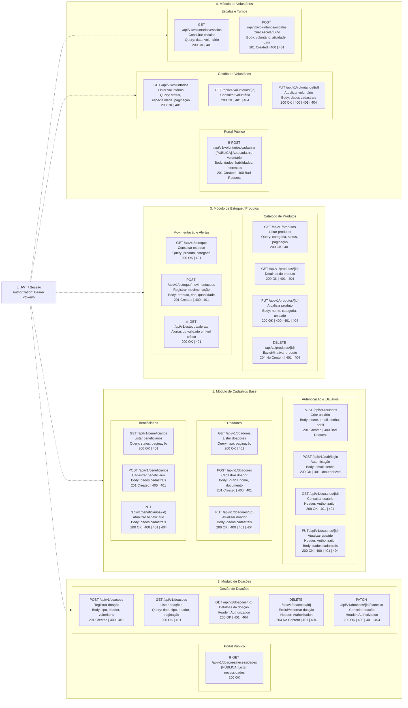

## Mapeamento e Documentação das Rotas da API (REST)

### A) Módulo de Autenticação e Usuários

**POST /api/v1/auth/login**

- **Descrição:** Autentica coordenadores/voluntários e gera o token de acesso.
- **Body:** `{ "email": "user@email.com", "senha": "123" }`
- **Resposta (200):** `{ "token": "eyJhbGciOi...", "usuario": { "id": 1, "nome": "Ana" } }`

**POST /api/v1/voluntarios/cadastrar**

- **Descrição:** Autocadastro público de novos voluntários da ONG.
- **Body:** `{ "nome": "Carlos", "email": "carlos@email.com", "telefone": "1999999999" }`
- **Resposta (201):** `{ "mensagem": "Voluntário cadastrado com sucesso!" }`

### B) Módulo de Gestão de Estoque e Insumos

**GET /api/v1/estoque**

- **Descrição:** Lista medicamentos em estoque com opção de ordenação por validade.
- **Headers:** `Authorization: Bearer <token>`
- **Resposta (200):** `[ { "id": 10, "produto": "Paracetamol", "quantidade": 50, "validade": "2026-12-31" } ]`

**POST /api/v1/estoque/cadastrar**

- **Descrição:** Cadastra um novo lote de medicamento no sistema.
- **Body:** `{ "produto": "Amoxicilina", "principioAtivo": "Amoxicilina", "quantidade": 100, "validade": "2027-01-01", "lote": "L123", "local": "Armário A" }`
- **Resposta (201):** `{ "id": 11, "status": "Cadastrado" }`

**PUT /api/v1/estoque/movimentar/:id**

- **Descrição:** Registra a baixa ou entrada manual/via código de barras de um item.
- **Body:** `{ "tipo": "SAIDA", "quantidade": 5, "motivo": "Ação de Campo" }`
- **Resposta (200):** `{ "id": 10, "novoEstoque": 45 }`

**GET /api/v1/estoque/alertas**

- **Descrição:** Retorna insumos com validade próxima (< 30 dias) ou abaixo do estoque mínimo.
- **Resposta (200):** `{ "vencimentoProximo": [...], "estoqueBaixo": [...] }`

### C) Módulo de Doações e Transparência Pública

**GET /api/v1/doacoes/necessidades**

- **Descrição:** Rota pública (sem auth) que lista insumos em falta para o portal de doações.
- **Resposta (200):** `[ { "item": "Soro Fisiológico", "prioridade": "ALTA" } ]`

**POST /api/v1/doacoes/registrar**

- **Descrição:** Registra a entrada de uma nova doação recebida.
- **Body:** `{ "doador": "Empresa X", "tipo": "MEDICAMENTO", "quantidade": 20 }`
- **Resposta (201):** `{ "id_arrecadacao": 505, "status": "Registrado" }`

