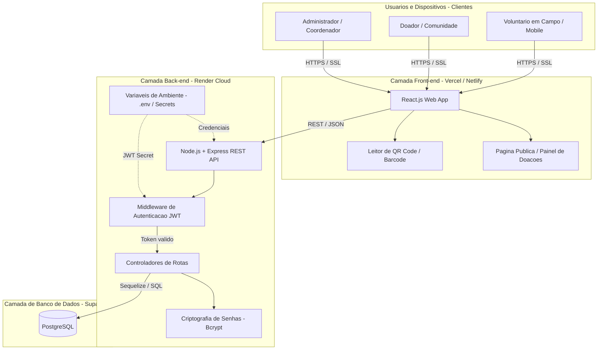

### Pilares de Segurança

# Documentação de Arquitetura — Segurança

## Mecanismos de Segurança e Proteção de Dados

* **HTTPS / SSL:** Criptografia em trânsito ponta a ponta para trafegar credenciais e dados sensíveis com segurança entre o *Front-end* e o *Express Router*.

* **Bcrypt (Hash + Salt):** Criptografia unidirecional aplicada às senhas (`bcrypt.compare`) antes da validação no *Controller* ou Banco de Dados, garantindo proteção contra vazamento de credenciais.

* **JWT (JSON Web Token):** Autenticação *stateless* com tempo de expiração definido em **8 horas**, gerado após a validação do login e exigido no cabeçalho `Authorization: Bearer <token>` para rotas protegidas.

* **Variáveis de Ambiente (`.env`):** Gerenciamento isolado da chave de assinatura `JWT_SECRET` e das credenciais do banco de dados no ambiente de hospedagem (*Render/Vercel*), impedindo a exposição de segredos no código-fonte.

* **Tratamento Padronizado de Erros de Autenticação:** Retorno rigoroso de códigos HTTP de segurança:

  * **`401 Unauthorized`:** Para falhas de credencial, token inválido ou ausente.
  * **`403 Forbidden`:** Reservado exclusivamente para restrições de permissão por perfil de usuário.

* **Política de CORS e Sanitização:** Restrição de origem das requisições via CORS e sanitização automática de dados no ORM (*Sequelize*) para prevenção de ataques como *SQL Injection* e *XSS*.
